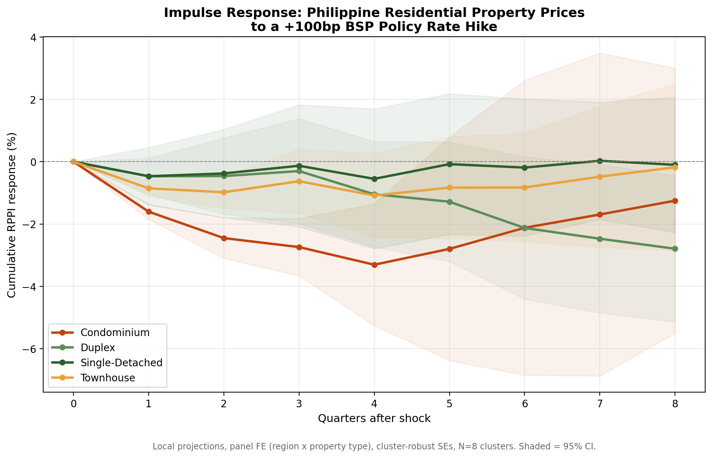
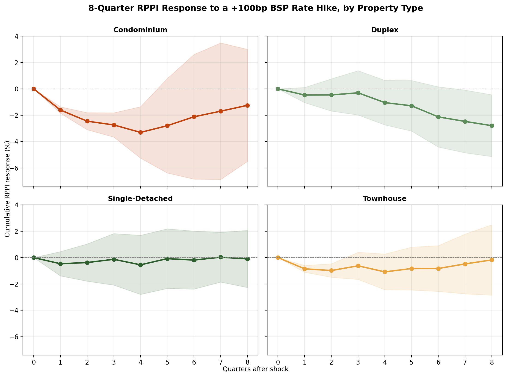
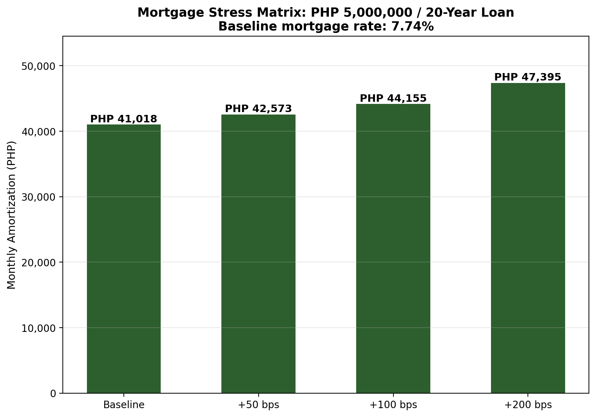

# BSP Housing Transmission Study

Hi there. This repo is my attempt to answer a simple question with real data tools: when the Bangko Sentral ng Pilipinas moves interest rates, how long does it take for home prices to feel it, and which types of homes move the most?

I built this as rate hikes kept eering the news, and I wanted to see the link between policy, mortgage payments, and property prices in sequence. Condos and single-detached homes do not react the same way. I wanted to show that. (P.S I intend to move out soon enough so renting prices in high-rated cities would empty my alr empty pockets)

## At a glance

The charts below show what happens when BSP raises rates by 100 basis points (1 percentage point). Home prices do not all move the same way. Condos tend to fall more and faster than single-detached homes. On the mortgage side, even a modest rate bump adds thousands of pesos to a monthly payment on a typical loan.



*A +100bp hike means a 1 percentage point increase in the policy rate. Lines below zero mean prices tend to fall over the quarters that follow.*

## What happens to home prices after a rate hike?

An impulse response (IRF) is just a fancy way of asking: if rates go up today, how do prices move over the next few quarters?



What the data shows:

- Condominiums show the largest drop and move faster than single-detached homes.
- Townhouses sit in the middle.
- Duplex and single-detached homes react more slowly.
- Effects build over several quarters, not overnight.

## What it does to your monthly payment

This is the part that hit home for me when I was thinking about rent and loan costs. The chart below uses a PHP 5,000,000 loan over 20 years and asks what happens if mortgage rates rise by 50, 100, or 200 basis points.



| Scenario | Monthly payment | Increase vs baseline |
|----------|----------------|----------------------|
| Baseline (7.74%) | PHP 41,018 | none |
| +50 bps | PHP 42,573 | +PHP 1,555 (3.8%) |
| +100 bps | PHP 44,155 | +PHP 3,137 (7.6%) |
| +200 bps | PHP 47,395 | +PHP 6,376 (15.5%) |

Values rounded for readability. Full precision is in `data/mortgage_stress_matrix.csv`.

## Headline finding

Condos are roughly 4-5x more sensitive to BSP rate changes than single-detached homes in this model. Townhouses also show a strong response, sitting between condos and the slower-moving detached housing types.

## Why this exists

BSP publishes useful summary stats on residential property prices (RPPI), but the loan-level detail behind those numbers is not public at the quarterly region-by-property-type level I needed. So I built a **calibrated synthetic panel**: fake microdata shaped to match real BSP and PSA turning points from 2018 through early 2026. The goal is reproducibility, not a claim that this is official BSP microdata.

The charts and tables above are the main outputs. For the full narrative, see [BSP_Housing_Transmission_Study.docx](report/BSP_Housing_Transmission_Study.docx).

## What is in each folder

```
bsp-housing-transmission/
├── R/                      # Main analysis pipeline (run this first)
├── python_verification/    # Cross-checks key R numbers in Python
├── data/                   # Panel dataset and result tables (CSV)
├── plots/                  # IRF and mortgage stress charts (PNG)
├── report/                 # Written study (Word doc)
└── outputs/                # Auto-generated tables when you re-run R (not in git)
```

| Folder | What you will find |
|--------|-------------------|
| `R/` | Six scripts, numbered in order. Start with `00_run_all.R` to run everything. |
| `python_verification/` | Optional sanity checks. Writes `*_verified.csv` files into `data/`. |
| `data/` | The panel (`bsp_rppi_panel.csv`) plus regression, bootstrap, IRF, diagnostic, and mortgage outputs. |
| `plots/` | Source images for this README: `irf_faceted.png`, `irf_overlay.png`, `mortgage_stress_matrix.png`. |
| `report/` | [BSP_Housing_Transmission_Study.docx](report/BSP_Housing_Transmission_Study.docx), the full writeup. |

## How to run

### R pipeline (full study)

From the project root:

```bash
Rscript R/00_run_all.R
```

Or open `R/00_run_all.R` in RStudio and run it. The script sets the working directory to the project root automatically.

**Required R packages:**

```r
install.packages(c(
  "tidyverse", "fixest", "fwildclusterboot", "modelsummary",
  "brms", "plm", "lmtest", "patchwork", "scales", "lubridate"
))
```

Model B (Bayesian) needs a Stan backend. The script header in `R/00_run_all.R` has `cmdstanr` install notes.

### Python verification (optional)

From the project root:

```bash
python python_verification/verify_pipeline.py
python python_verification/mortgage_and_diagnostics.py
```

These read and write under `data/`. Verified outputs use the `_verified` suffix and are gitignored.

**Python packages:** `numpy`, `pandas`, `statsmodels`, `scipy`

## Key outputs

| File | What it is |
|------|-----------|
| `data/bsp_rppi_panel.csv` | Quarterly panel: 8 region x property-type units, 34 quarters |
| `data/regression_results.csv` | Model A1 interaction coefficients (policy rate x property type) |
| `data/wild_cluster_bootstrap_results.csv` | Small-sample robust p-values (wild cluster bootstrap) |
| `data/local_projections_irf.csv` | 8-quarter price response after a +100bp hike |
| `data/diagnostic_tests.csv` | Unit root, serial correlation, heteroskedasticity, pass-through checks |
| `data/mortgage_stress_matrix.csv` | Monthly payment impact for +0, +50, +100, +200bp scenarios |
| `report/BSP_Housing_Transmission_Study.docx` | Full written study with methodology and discussion |

## Important note on the data

All panel observations are **synthetic but calibrated** to published BSP RRP paths and PSA/BSP RPPI trends. Use this repo to reproduce the analysis logic and explore transmission patterns. Do not treat the CSV as confidential BSP loan records.

## License

MIT License. See [LICENSE](LICENSE).
